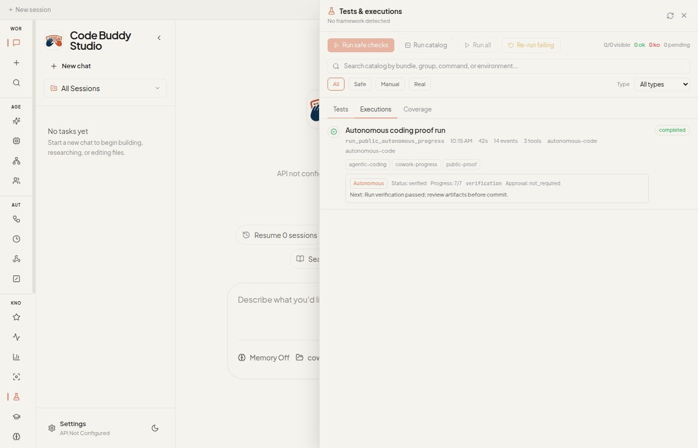

# Autonomous Coding And Cowork Progress

This page documents the end-to-end autonomous coding path added for the V1
fleet/Cowork milestone: Code Buddy can run a bounded software task from a task
contract, persist the run in the durable observability store, and expose the
same progress in Cowork's `Tests & executions` cockpit.

## Operator Goal

Use this flow when the instruction is:

```text
Execute this development task autonomously from start to finish, keep the work
bounded to the declared files, run verification, persist evidence, and let me
follow the run from Cowork.
```

The integrated operator prompt should keep these requirements:

- create or load an `AgenticCodingTaskContract`;
- validate scope, allowed paths, risk level, verification commands, and
  approval requirements before mutation;
- emit durable run events for each major step;
- write machine-readable artifacts for later review;
- surface the same status in Cowork without exposing private paths or secrets;
- stop before commit/push/release unless the user explicitly asks for it.

## What Runs

The CLI entry point is:

```bash
buddy autonomous-code --task-file task.json --json
```

Useful options:

```bash
buddy autonomous-code \
  --task-file task.json \
  --generate-edit-proposal-file edit-proposal.json \
  --apply-edits \
  --require-preview \
  --run-verification \
  --json
```

For overnight-style work:

```bash
buddy autonomous-code \
  --task-file task.json \
  --autonomy-preset overnight \
  --apply-edits \
  --require-preview \
  --run-verification \
  --json
```

For a resumed decomposed run:

```bash
buddy autonomous-code --resume <run-id> --json
```

The task contract is intentionally explicit. A minimal safe example:

```json
{
  "id": "docs-proof-run",
  "objective": "Update the project documentation proof table.",
  "allowedPaths": ["docs/application-validation-guide.md"],
  "riskLevel": "low",
  "verification": [
    {
      "command": "npm run typecheck",
      "reason": "The docs change must not break generated type imports."
    }
  ],
  "acceptanceCriteria": [
    "The guide includes the command used for verification.",
    "The guide states which screenshots are public-safe."
  ]
}
```

## Durable Evidence

Each autonomous run now creates a `RunStore` record unless the caller opts out
with `recordObservability: false` for nested internal runs.

The run includes:

- run metadata: objective, source channel, tags, start/end time and status;
- step events: validation, proposal load/generation, approval load, workflow
  proposal load, checkpoint, preflight, preview, apply, verification;
- decision events: `agentic_coding_started` and `agentic_coding_finished`;
- patch and verification events when edits and checks run;
- artifacts: `agentic-coding-report.json` and `workflow-progress.json`.

`workflow-progress.json` is the Cowork bridge contract. It uses:

```json
{
  "kind": "agentic-coding-workflow-progress",
  "activeNodeId": "verification",
  "approvalState": "not_required",
  "counts": {
    "blocked": 0,
    "completed": 7,
    "pending": 0,
    "ready": 0,
    "total": 7
  },
  "nextAction": {
    "type": "complete",
    "nodeId": "verification",
    "message": "Run verification passed; review artifacts before commit."
  },
  "source": {
    "status": "verified"
  }
}
```

The path to the run store is controlled by:

```bash
CODEBUDDY_RUNS_DIR=/tmp/codebuddy-runs buddy autonomous-code --task-file task.json --json
```

If `CODEBUDDY_RUNS_DIR` is not set, the store follows `CODEBUDDY_HOME/runs`.

## Cowork View

Cowork reads the same `RunStore` through `AuditBridge`.

Open:

```text
Cowork -> Tests & executions -> Executions
```

For autonomous runs, the row shows:

- `Autonomous` badge;
- status from the progress artifact;
- completed/total progress;
- active workflow node;
- approval state;
- next action message.

Public-safe capture:



If the run metadata says `autonomous-code` or `agentic-coding` but the progress
artifact is not available yet, Cowork shows a pending progress snapshot message
instead of fabricating state.

## Reproduction Proof

Latest local proof in this branch: 2026-06-06, Europe/Paris.

Commands run:

```bash
npm test -- \
  tests/agent/autonomous/agentic-coding-runner.test.ts \
  tests/agent/autonomous/checkpoint-resume.test.ts \
  tests/commands/autonomous-code-command.test.ts \
  tests/observability/run-store.test.ts

npm run typecheck

cd cowork
npm test -- tests/audit-bridge.test.ts tests/test-runner-panel-filters.test.ts
npm run typecheck
npm run lint
npm run build:e2e
npx playwright test e2e/test-runner-autonomous-progress.spec.ts --reporter=list
```

Observed results:

- core autonomous/observability suite: `151` tests passed;
- Cowork audit/test-runner focused suite: `17` tests passed;
- root TypeScript typecheck: passed;
- Cowork TypeScript typecheck: passed;
- Cowork lint: passed with only existing warnings outside this feature;
- Cowork E2E Vite build: passed;
- autonomous progress Playwright screenshot: passed and generated capture `110`.

A CLI smoke run with an isolated `CODEBUDDY_RUNS_DIR` also returned:

```json
{
  "status": "ready",
  "summaryStatus": "completed",
  "hasProgressArtifact": true,
  "events": ["run_start", "decision", "step_start", "step_end", "patch_created", "run_end"]
}
```

This smoke output is intentionally summarized. The full local run paths are not
published because they can reveal usernames or private checkout layout.

## Privacy And Secret Handling

Do not commit raw autonomous artifacts if they contain:

- full local home paths;
- API keys or provider tokens;
- account emails or account ids;
- private repository names;
- unredacted command stdout from customer projects;
- browser tabs, notifications, or terminal history in screenshots.

Safe evidence should use:

- synthetic objectives;
- isolated temp workspaces;
- `CODEBUDDY_RUNS_DIR` pointing at a temp directory;
- relative paths where possible;
- redacted summaries for command output;
- screenshots reviewed before commit.

## Implementation Anchors

- Core runner: `src/agent/autonomous/agentic-coding-runner.ts`
- Task contract: `src/agent/autonomous/agentic-coding-contract.ts`
- CLI command: `src/commands/cli/autonomous-code-command.ts`
- Durable run store: `src/observability/run-store.ts`
- Cowork audit bridge: `cowork/src/main/observability/audit-bridge.ts`
- Cowork execution UI: `cowork/src/renderer/components/TestRunnerPanel.tsx`
- Core tests: `tests/agent/autonomous/agentic-coding-runner.test.ts`
- Resume tests: `tests/agent/autonomous/checkpoint-resume.test.ts`
- Cowork bridge tests: `cowork/tests/audit-bridge.test.ts`
- Screenshot proof: `cowork/e2e/test-runner-autonomous-progress.spec.ts`
